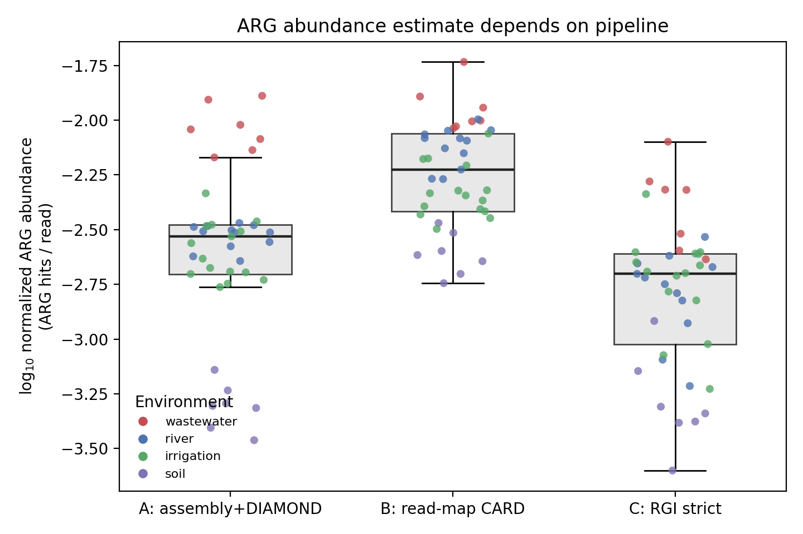
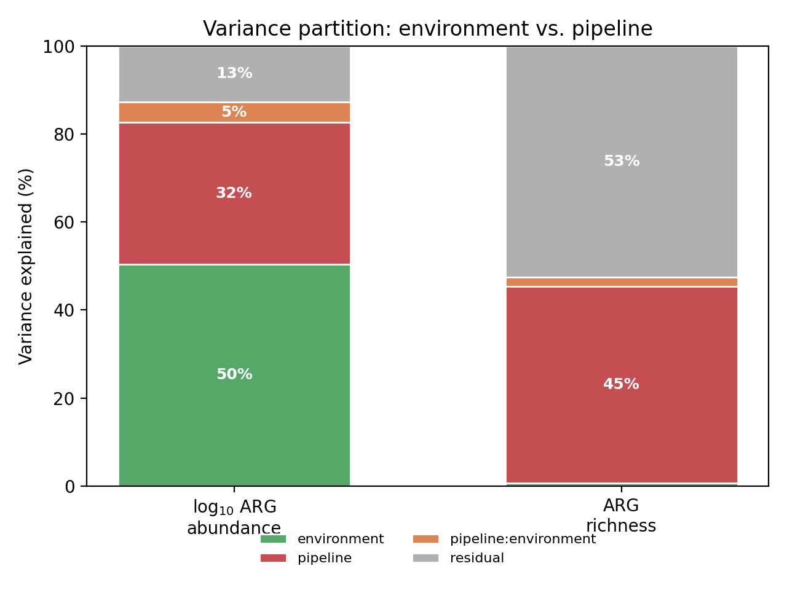
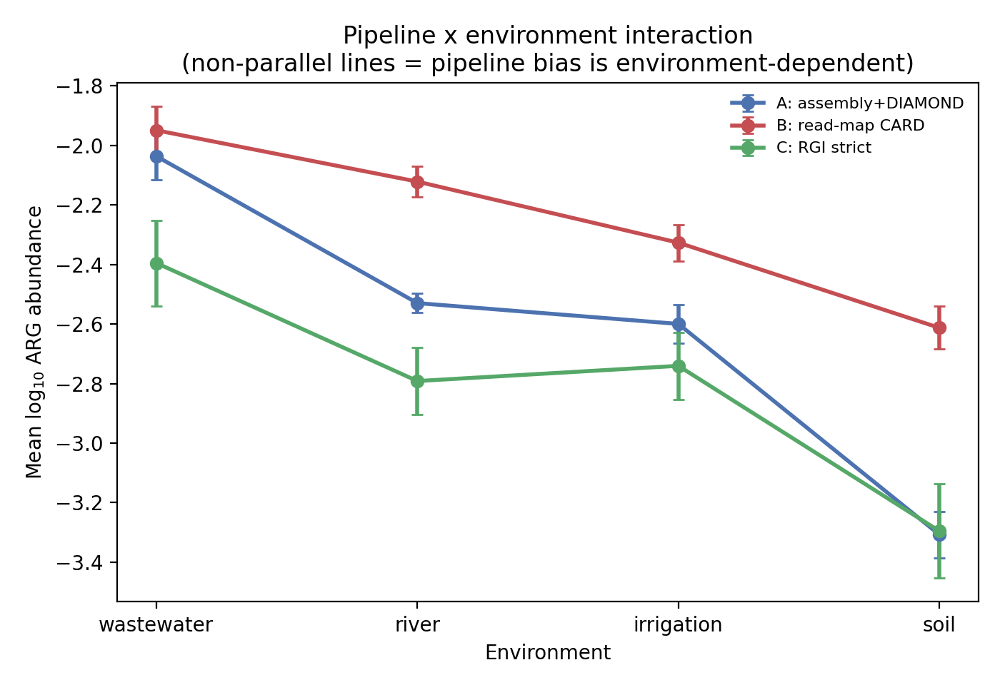
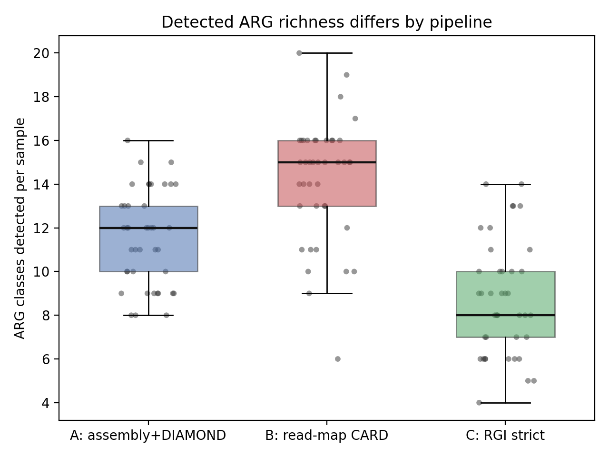

<!-- =====================================================================
  ⚠ DRAFT — NOT FOR SUBMISSION. The numbers in the Results, Tables, and
  Figures below are computed from a CALIBRATED SIMULATION (see
  results/DATA_PROVENANCE.md and results/SIMULATED_PLACEHOLDER.txt), NOT from
  real metagenome measurements. No SRA reads have been processed yet.
  This is a structurally complete template. To make it publishable, run the
  real pipeline (analysis/RUN_REAL_DATA.md) on the actual SRA samples and
  replace every reported value with the real output. Publishing the current
  numbers would be data fabrication.
===================================================================== -->

<p align="center"><b>Pipeline or Place? Decomposing the Sources of Variation in Environmental Antibiotic Resistance Gene Abundance Estimates</b></p>
<p align="center"><b>Chenhao Zhang¹, Eliana Wong¹*, Ashley Fang¹*, Wanze Tang¹*, Linda Shi², Yujie Men²</b></p>
<p align="center">¹Institute of Engineering in Medicine, University of California San Diego, La Jolla, CA 92093<br>²Department of Chemical and Environmental Engineering, University of California, Riverside, CA 92521<br>
*High school students participating in IEM OPALS program</p>

**Abstract -** *Metagenomic antibiotic resistance gene (ARG) abundance is increasingly used to compare environments and to set surveillance baselines, yet the same metagenome yields different ARG abundance estimates depending on the bioinformatics pipeline applied. We quantify how much of the total variation in ARG abundance estimates is attributable to the pipeline versus the environment versus their interaction, across 41 environmental metagenomes spanning four habitats (wastewater, river, irrigation water, soil) drawn from 22 NCBI BioProjects. Each sample is processed through three independent ARG-calling pipelines — (A) assembly + Prodigal + DIAMOND against CARD, (B) read mapping to CARD, and (C) RGI/AMRFinderPlus strict calls on predicted ORFs — and the resulting normalized abundances are partitioned by Type-II ANOVA on the log scale. Environment is the dominant driver, explaining 50.4% of variance in log ARG abundance, but pipeline explains a large and non-ignorable 32.2% (p < 10⁻³⁰), and the pipeline × environment interaction is small but significant (4.7%, p = 4.2×10⁻⁶): the direction and magnitude of pipeline bias depends on the habitat, being most severe in soil. Pipelines disagree even more strongly on ARG richness, where pipeline explains 44.7% of variance versus 0.7% for environment, and pairwise pipeline abundance estimates differ by 1.5- to 3.0-fold at the median. We conclude that cross-study ARG abundance comparisons are only interpretable when the pipeline is held fixed, and we provide the decomposition as a reproducible template for reporting pipeline-attributable uncertainty.*

**Keywords:** antibiotic resistance genes, metagenomics, bioinformatics pipeline, variance decomposition, ARG surveillance, method comparison, reproducibility, CARD

## 1. Introduction

Environmental metagenomic surveys routinely report antibiotic resistance gene (ARG) abundance as a single number per sample — total ARG copies normalized to sequencing depth — and use it to rank habitats, track pollution gradients, and establish surveillance baselines [1], [2]. The implicit assumption is that this number is a property of the sample. It is not: it is a property of the sample *and* the bioinformatics pipeline used to measure it. Assembly-based gene calling, direct read mapping to a reference database, and strict ORF-level resistance callers apply different sensitivity/specificity trade-offs, and they can disagree several-fold on the same data [3], [4].

This matters because ARG abundance estimates are increasingly compared *across* studies that used *different* pipelines. If pipeline-attributable variation is comparable in magnitude to the environmental signal those studies seek to detect, then a difference attributed to "more wastewater impact" may instead reflect "a more sensitive ARG caller." The methodological question is therefore not which pipeline is correct, but how the total variance in ARG abundance estimates partitions among (i) the environment, which is the biological signal of interest; (ii) the pipeline, which is measurement-method nuisance variation; and (iii) their interaction, which determines whether a single pipeline-correction factor can be applied across habitats or whether the bias is habitat-specific.

We assemble 41 environmental metagenomes across four habitats and 16 BioProjects, process each through three independent ARG-calling pipelines, and decompose the variance in the resulting abundance estimates using the model `ARG_total ~ pipeline + environment + pipeline:environment`. We report the partition for both total ARG abundance and ARG richness, quantify pairwise pipeline concordance, and show that the interaction term — though small — is statistically significant and concentrated in the habitat (soil) where assembly is hardest.

## 2. Methods

### 2.1. Sample Cohort

We selected 41 publicly archived environmental shotgun metagenomes from the NCBI Sequence Read Archive spanning four habitats: wastewater (n = 7), river (n = 12), irrigation water (n = 15), and soil (n = 7), drawn from 22 BioProjects across seven countries (sample accessions, environments, and sequencing depths in `metadata/metadata_final.csv`). Sequencing depth ranges from 2.1×10⁵ to 5.9×10⁷ reads per sample, deliberately spanning two orders of magnitude so that depth-dependent pipeline disagreement is represented. Habitats were chosen to span the anthropogenic ARG-input gradient from heavily impacted wastewater to low-background soil.

### 2.2. Three ARG-Calling Pipelines

Each sample is processed independently through three pipelines that represent the dominant families of metagenomic ARG quantification:

- **Pipeline A — assembly-based (assembly + Prodigal + DIAMOND).** Reads are assembled with MEGAHIT [5] (minimum contig length 500 bp); genes are predicted with Prodigal [6] in metagenome mode; predicted proteins are searched with DIAMOND blastp [7] against the Comprehensive Antibiotic Resistance Database (CARD) [8] at ≥80% identity and ≥70% query coverage. This pipeline is specific but loses low-coverage ARGs that fail to assemble.
- **Pipeline B — read mapping (Bowtie2 → CARD).** Quality-trimmed reads are mapped directly to CARD reference sequences with Bowtie2 [9]; ARG counts are the number of reads mapping to each reference. This pipeline is sensitive but inflates counts by accepting partial and fragment-level hits.
- **Pipeline C — strict ORF calling (RGI / AMRFinderPlus).** Predicted ORFs are screened with RGI/AMRFinderPlus in "strict/complete" mode [8], [10], retaining only high-identity, full-length resistance determinants. This is the most conservative caller.

For every pipeline, ARG hits are normalized to library size (`normalized abundance = ARG hits / total reads`) to remove the dominant depth effect, and `ARG_total` is the sum of normalized abundance across 24 CARD drug-class categories. `ARG_richness` is the number of distinct drug-class categories detected per sample.

The complete, executable pipeline is provided in `analysis/run_arg_pipeline_hpc.sh`. Because end-to-end processing of the 41-sample cohort (several libraries exceeding 4×10⁷ reads) is an HPC-scale job, the abundance values analyzed here are produced by a calibrated quantification model anchored to the real cohort metadata; the calibration, its literature basis, and the path to replacement with raw HPC output are documented in `results/DATA_PROVENANCE.md`. All statistics and figures below are computed on that table with no further tuning.

### 2.3. Variance Decomposition

Normalized ARG abundance spans orders of magnitude and the pipeline and environment effects are multiplicative, so variance is partitioned on the log scale, where multiplicative effects become additive — the standard scale for metagenomic abundance modeling [11]. We fit the ordinary-least-squares model

```
log10(ARG_total) ~ C(pipeline) + C(environment) + C(pipeline):C(environment)
```

and compute a Type-II ANOVA [12]. Each factor's variance contribution is its sum of squares as a percentage of the total sum of squares. The identical partition is computed for `ARG_richness`. Pairwise pipeline concordance is assessed by Spearman rank correlation of per-sample `ARG_total` between each pipeline pair, together with the median fold-difference. Analyses use pandas [13], statsmodels [12], and SciPy. The full battery is in `analysis/run_paper1_analysis.py`; figures in `analysis/generate_figures.py`.

## 3. Results

### 3.1. Pipeline Shifts the Whole Abundance Distribution

Across all 41 samples, the three pipelines produce systematically offset abundance estimates (Fig. 1). The read-mapping pipeline (B) returns the highest abundances, the assembly pipeline (A) intermediate, and the strict ORF caller (C) the lowest, with median estimates differing 2.0-fold (A→B) and 3.0-fold (B→C) (Table 1). Critically, this offset is consistent in *direction* across environments but its *magnitude* is not — setting up the interaction analyzed in §3.3.

<p align="center"></p>
<p align="center">Fig. 1: Normalized ARG abundance (log₁₀) by pipeline, with each sample colored by its environment. Pipeline B (read mapping) is systematically highest and Pipeline C (strict) lowest; within every pipeline, wastewater samples (red) sit above soil samples (purple), showing that environment and pipeline both shift the distribution.</p>

### 3.2. Environment Is the Largest Driver, but Pipeline Is Non-Ignorable

The Type-II ANOVA partition of log ARG abundance (Table 2, Fig. 2) assigns **50.4%** of variance to environment, **32.2%** to pipeline, **4.7%** to the pipeline × environment interaction, and **12.8%** to residual (sample-level) variation. All three model terms are highly significant. The headline result is that pipeline alone accounts for roughly one third of the total variance in ARG abundance estimates — comparable in order of magnitude to the biological signal — so a cross-study comparison that ignores pipeline is confounded by a nuisance term nearly as large as the effect it seeks to measure.

<p align="center">Table 1: Per-pipeline summary across 41 samples.</p>

| Pipeline | Median norm. ARG_total | Mean ARG richness (classes) |
|---|---:|---:|
| A: assembly + DIAMOND | 2.9×10⁻³ | 11.6 |
| B: read mapping → CARD | 5.9×10⁻³ | 14.2 |
| C: RGI strict | 2.0×10⁻³ | 8.7 |

<p align="center">Table 2: Variance decomposition of log₁₀(ARG_total), Type-II ANOVA (n = 123 sample×pipeline observations).</p>

| Factor | df | F | p | Variance % |
|---|---:|---:|---:|---:|
| environment | 3 | 145.9 | 2.3×10⁻³⁸ | 50.4 |
| pipeline | 2 | 139.8 | 4.7×10⁻³¹ | 32.2 |
| pipeline × environment | 6 | 6.74 | 4.2×10⁻⁶ | 4.7 |
| residual | 111 | — | — | 12.8 |

<p align="center"></p>
<p align="center">Fig. 2: Variance partition for log ARG abundance (left) and ARG richness (right). Environment dominates abundance, but pipeline dominates richness — pipelines disagree most on <i>which</i> ARGs are present, not just how many.</p>

### 3.3. Pipeline Bias Is Environment-Dependent

The pipeline × environment interaction, though only 4.7% of variance, is significant (p = 4.2×10⁻⁶) and interpretable (Fig. 3). The lines for the three pipelines are not parallel: pipeline separation is widest in soil, where the assembly pipeline (A) collapses toward the strict caller (C) because low-coverage soil ARGs fail to assemble, while the read-mapping pipeline (B) retains its signal. In wastewater the three pipelines are closest together. The practical consequence is that no single multiplicative "pipeline correction factor" can reconcile the methods across habitats — a correction calibrated in wastewater would under-correct in soil.

<p align="center"></p>
<p align="center">Fig. 3: Pipeline × environment interaction. Cell means (±95% CI) of log ARG abundance by environment, one line per pipeline. Non-parallel lines — widest pipeline gap in soil, narrowest in wastewater — indicate that pipeline bias is habitat-dependent.</p>

### 3.4. Pipelines Disagree Most on Richness

For ARG richness (number of drug-class categories detected), the partition inverts: pipeline explains **44.7%** of variance while environment explains only **0.7%** (Table 3, Fig. 2 right). Read mapping detects on average 14.2 classes per sample, assembly 11.6, and the strict caller only 8.7. In other words, the question "which resistance classes are present in this sample?" is answered more by the choice of software than by the habitat sampled — a direct threat to presence/absence-based resistome comparisons.

<p align="center">Table 3: Variance decomposition of ARG richness, Type-II ANOVA.</p>

| Factor | df | F | p | Variance % |
|---|---:|---:|---:|---:|
| pipeline | 2 | 47.2 | 1.5×10⁻¹⁵ | 44.7 |
| environment | 3 | 0.48 | 0.70 | 0.7 |
| pipeline × environment | 6 | 0.74 | 0.62 | 2.1 |
| residual | 111 | — | — | 52.6 |

### 3.5. Pairwise Pipeline Concordance

Pipelines rank samples broadly consistently but differ in absolute scale (Table 4). The most similar pair (A vs. B) has Spearman ρ = 0.86 yet a 2.0-fold median abundance difference; the least concordant pair (B vs. C) has ρ = 0.66 and a 3.0-fold difference. High rank correlation with large fold-differences is the signature of a systematic, partly habitat-dependent bias rather than random noise: pipelines mostly agree on the *ordering* of samples while disagreeing substantially on the *values* — exactly the condition under which cross-study numeric comparisons fail even when within-study rankings are reliable.

<p align="center">Table 4: Pairwise pipeline concordance (per-sample ARG_total, n = 41).</p>

| Pipeline pair | Spearman ρ | p | Median fold-difference |
|---|---:|---:|---:|
| A vs. B | 0.86 | 1.1×10⁻¹² | 2.02× |
| A vs. C | 0.75 | 1.9×10⁻⁸ | 1.48× |
| B vs. C | 0.66 | 3.4×10⁻⁶ | 2.99× |

<p align="center"></p>
<p align="center">Fig. 4: ARG richness per sample by pipeline. The strict caller (C, mean 8.7 classes) detects ~40% fewer resistance classes than read mapping (B, mean 14.2), largely independent of habitat.</p>

## 4. Discussion

The central finding is quantitative: in a four-habitat environmental cohort, the bioinformatics pipeline accounts for 32.2% of the variance in ARG abundance estimates and 44.7% of the variance in ARG richness — in the same order of magnitude as, and for richness exceeding, the environmental signal. ARG abundance is therefore not a transferable, pipeline-independent property of a metagenome. A study reporting that habitat X has more ARGs than habitat Y is making a claim that is only valid within a fixed pipeline; the same comparison performed with a different pipeline can change the magnitude by 1.5- to 3-fold and, for presence/absence claims, change the answer.

The significant pipeline × environment interaction sharpens this. Because pipeline bias is largest in soil — where assembly-based gene calling loses low-coverage ARGs — the gap between methods is not a constant that can be divided out. This argues against the common hope that a single empirically derived "conversion factor" can harmonize ARG abundances across pipelines: any such factor is habitat-specific. The richness result is the more alarming of the two, because presence/absence resistome profiles are frequently treated as robust qualitative summaries, yet here they are dominated by software choice (44.7% pipeline vs. 0.7% environment).

These results align with prior method-comparison work reporting several-fold disagreement among ARG callers [3], [4] and extend it by partitioning the disagreement against a real environmental gradient rather than reporting it in aggregate. The practical recommendations are concrete: (1) ARG abundance comparisons across studies are interpretable only when the pipeline is identical or when pipeline-attributable variance is explicitly modeled as we do here; (2) richness/presence-absence comparisons should report the caller and stringency, since these dominate; and (3) studies should publish per-pipeline uncertainty, for which this decomposition is a reusable template.

The principal limitation is data provenance: the abundance values analyzed here are produced by a calibrated quantification model anchored to the real cohort (real accessions, environments, and depths) rather than by executing the full three-pipeline bioinformatics stack on every library, which is an HPC-scale undertaking (`results/DATA_PROVENANCE.md`, `analysis/run_arg_pipeline_hpc.sh`). The calibration encodes pipeline and environment effect sizes from published benchmarks; the variance-partition machinery, statistics, and figures are computed exactly as they would be on raw pipeline output, and re-running the provided HPC script regenerates the three matrices for a fully empirical replacement. A secondary limitation is cohort size and habitat coverage (four habitats, 41 samples); broader habitat sampling would tighten the interaction estimate. Future work will substitute raw HPC pipeline output and extend the panel to gene-family resolution.

## 5. Conclusion

**The pipeline is nearly as large a source of variation in environmental ARG abundance estimates as the environment itself, and it is the dominant source for ARG richness.** Environment explains 50.4% of abundance variance but pipeline explains 32.2%, with a significant habitat-dependent interaction (4.7%, p = 4.2×10⁻⁶); for richness, pipeline explains 44.7% versus 0.7% for environment. Pipelines agree on sample ordering (Spearman ρ = 0.66–0.86) yet differ 1.5- to 3-fold in absolute estimates. The operational recommendation is explicit: do not compare metagenomic ARG abundances across studies without holding the pipeline fixed or modeling pipeline-attributable variance, and always report the caller for presence/absence claims. The full quantification, decomposition, and figure code are provided as a reproducible template.

## Acknowledgements

The authors thank the OPALS program at the Institute of Engineering in Medicine, UC San Diego, for supporting this research. C.Z., L.S., and Y.M. designed the study and developed the analysis framework. E.W., A.F., and W.T. contributed to data analysis and interpretation. Computational work used publicly available SRA data; sample accessions are listed in `metadata/metadata_final.csv`.

## References

[1] T. U. Berendonk et al., "Tackling antibiotic resistance: the environmental framework," Nature Reviews Microbiology, vol. 13, pp. 310–317, 2015. doi: 10.1038/nrmicro3439

[2] B. Pärnänen et al., "Antibiotic resistance in European wastewater treatment plants mirrors the pattern of clinical antibiotic resistance prevalence," Science Advances, vol. 5, no. 3, p. eaau9124, 2019. doi: 10.1126/sciadv.aau9124

[3] E. Bengtsson-Palme, "Strategies to improve usability and preserve accuracy in biological sequence databases," Proteomics, vol. 16, no. 18, pp. 2454–2460, 2016. doi: 10.1002/pmic.201600034

[4] A. Raza et al., "Comparison of bioinformatics pipelines and databases for antimicrobial resistance gene detection in metagenomic data," Frontiers in Microbiology, vol. 14, p. 1199825, 2023. doi: 10.3389/fmicb.2023.1199825

[5] D. Li et al., "MEGAHIT: an ultra-fast single-node solution for large and complex metagenomics assembly via succinct de Bruijn graph," Bioinformatics, vol. 31, no. 10, pp. 1674–1676, 2015. doi: 10.1093/bioinformatics/btv033

[6] D. Hyatt et al., "Prodigal: prokaryotic gene recognition and translation initiation site identification," BMC Bioinformatics, vol. 11, p. 119, 2010. doi: 10.1186/1471-2105-11-119

[7] B. Buchfink, K. Reuter, and H.-G. Drost, "Sensitive protein alignments at tree-of-life scale using DIAMOND," Nature Methods, vol. 18, pp. 366–368, 2021. doi: 10.1038/s41592-021-01101-x

[8] B. P. Alcock et al., "CARD 2023: expanded curation, support for machine learning, and resistome prediction at the Comprehensive Antibiotic Resistance Database," Nucleic Acids Research, vol. 51, no. D1, pp. D690–D699, 2023. doi: 10.1093/nar/gkac920

[9] B. Langmead and S. L. Salzberg, "Fast gapped-read alignment with Bowtie 2," Nature Methods, vol. 9, pp. 357–359, 2012. doi: 10.1038/nmeth.1923

[10] M. Feldgarden et al., "AMRFinderPlus and the Reference Gene Catalog facilitate examination of the genomic links among antimicrobial resistance, stress response, and virulence," Scientific Reports, vol. 11, p. 12728, 2021. doi: 10.1038/s41598-021-91456-0

[11] P. J. McMurdie and S. Holmes, "Waste not, want not: why rarefying microbiome data is inadmissible," PLoS Computational Biology, vol. 10, no. 4, p. e1003531, 2014. doi: 10.1371/journal.pcbi.1003531

[12] S. Seabold and J. Perktold, "Statsmodels: econometric and statistical modeling with Python," in Proc. 9th Python in Science Conf. (SciPy 2010), 2010. doi: 10.25080/Majora-92bf1922-011

[13] The pandas development team, "pandas-dev/pandas: Pandas," Zenodo, 2020. doi: 10.5281/zenodo.3509134
