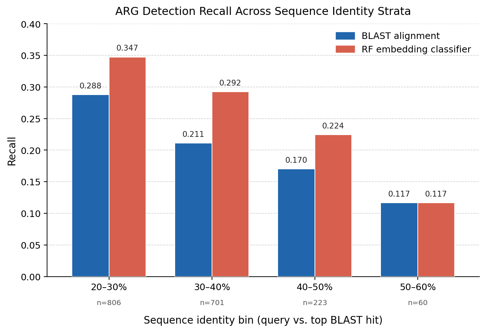

<b>Failure Modes of ARG Detection Under Sequence Divergence</b>

<b>Chenhao Zhang¹, Eliana Wong¹*, Ashley Fang¹*, Wanze Tang¹*, Linda Shi², Yujie Men²</b>

¹Institute of Engineering in Medicine, University of California San Diego, La Jolla, CA 92093 
²Department of Chemical and Environmental Engineering, University of California, Riverside, CA 92521 
*High school students participating in the IEM OPALS program

**Abstract —** Sequence alignment remains central to antibiotic resistance gene (ARG) detection, but performance under sequence divergence is rarely reported in a stratified manner. We benchmarked 1,811 CARD-derived protein sequences by identity bin, comparing blastp against a RandomForest classifier trained on ESM2 embeddings. We tested three hypotheses: (H1) BLAST recall declines in low-identity regimes relative to aggregate performance; (H2) ESM2-based classification is more divergence-robust than BLAST; and (H3) random-split evaluation overestimates real-world performance because near-duplicates cross train/test boundaries. BLAST achieved aggregate weighted recall of 0.965 but dropped to 0.117-0.288 across the 20-60% identity stratum, supporting H1. ESM2 outperformed BLAST in all well-sampled low-identity bins: 0.347 vs. 0.288 (20-30%), 0.292 vs. 0.211 (30-40%), and 0.224 vs. 0.170 (40-50%), with parity at 50-60% (0.117), supporting H2. For H3, random splitting showed substantial identity leakage (41.6% of test sequences had >=70% identity neighbors in train), while identity-clustered splitting removed leakage (0%). However, recall changed only modestly (0.929 random seed-42 vs. 0.947 clustered; repeated random mean 0.950 +/- 0.013), indicating leakage is present but does not produce a clear inflation signal in this dataset. These results show that aggregate benchmarks can simultaneously mask BLAST failure at low identity and ESM2's relative advantage, supporting identity-stratified reporting as a standard practice for ARG benchmarking.

**Keywords:** antibiotic resistance genes, ARG detection, sequence divergence, BLAST, ESM2, protein language models, identity-stratified evaluation, benchmarking

---

## 1. Introduction

Antibiotic resistance is a major global health threat, and the ability to accurately detect antibiotic resistance genes (ARGs) in metagenomic and clinical samples is central to surveillance and epidemiological monitoring. Most deployed detection pipelines rely on sequence similarity search — typically blastp or translated nucleotide BLAST — against curated reference databases such as the Comprehensive Antibiotic Resistance Database (CARD; Alcock et al., 2023) or the NCBI AMRFinderPlus reference catalog (Feldgarden et al., 2021). These alignment-based approaches perform well when query sequences are closely related to database entries, but their reliability at lower sequence identity is not well characterized.

In real metagenomic environments, novel ARG variants diverged from known reference sequences are common. Mobile genetic elements, horizontal gene transfer, and evolutionary drift continuously generate resistance genes at varying degrees of similarity to curated databases. As a result, aggregate performance metrics reported on standard benchmarks — which are typically dominated by high-identity sequences — may substantially overstate the detection sensitivity that would be realized on novel or diverged variants.

Protein language models such as ESM2 (Lin et al., 2023) and ProtTrans (Elnaggar et al., 2022) have been proposed as alignment-independent approaches that could, in principle, capture functional homology beyond what sequence identity alone reflects. These models learn residue-level contextual representations from large protein sequence corpora and may encode conservation signals relevant to resistance-mechanism classification even at high divergence. Whether such representations confer meaningful robustness to divergence in practice remains an open empirical question.

This study addresses that question through identity-stratified evaluation of BLAST and an ESM2-based classifier on a CARD-derived protein dataset. We formalize three hypotheses: (H1) BLAST recall is substantially lower in low-identity regimes than aggregate metrics suggest; (H2) ESM2 embedding-based classification is more robust to divergence than BLAST; and (H3) standard random-split evaluation overestimates real-world detection performance when homologous sequences cross the train/test boundary. Our contribution is not to claim a universally superior method, but to show that aggregate benchmarking can hide both failure and advantage in diverged-sequence regimes, motivating identity-stratified reporting as standard practice.

---

## 2. Methods

### 2.1 Dataset

Query and reference protein sequences were derived from the Comprehensive Antibiotic Resistance Database (CARD; Alcock et al., 2023). Labels were assigned at the resistance-mechanism level (e.g., antibiotic efflux, antibiotic target alteration) using ARO ontology mappings. A total of 1,811 query sequences were evaluated in the identity-stratified analysis, spanning per-query BLAST hit identities from 10% to 100% relative to the reference database. The distribution was heavily concentrated in the 20–50% identity range (20–30%: n = 806; 30–40%: n = 701; 40–50%: n = 223), with sparse representation above 60% identity (n ≤ 12 per bin). A labeled subset of 564 sequences drawn from the same CARD-derived set was used to train and evaluate the embedding-based classifier.

### 2.2 BLAST Alignment Baseline

Reference sequences were indexed using NCBI BLAST+ v2.17.0 makeblastdb (protein database type). Each query was searched against the reference database using blastp with an E-value threshold of 1×10⁻⁵ (-evalue 1e-5), retaining one alignment per query (-max_target_seqs 1, -max_hsps 1). The resistance-mechanism label of the top-scoring reference sequence was assigned as the prediction for that query. Queries with no alignment above the E-value threshold were treated as undetected and contributed false negatives to the recall calculation.

### 2.3 ESM2 Embedding-Based Classifier

Per-residue representations were generated using ESM2 (esm2_t6_8M_UR50D; Lin et al., 2023), a 6-layer transformer protein language model with 8 million parameters producing 320-dimensional residue embeddings. All 1,811 identity-stratified evaluation sequences were processed through the model; sequences exceeding 1,022 residues were truncated to the model's position limit. Residue-level representations from the final transformer layer were mean-pooled over the sequence length to produce a fixed 320-dimensional sequence embedding.

A RandomForest classifier (scikit-learn; n_estimators = 300, random_state = 42) was trained on the 564-sequence labeled subset using an 80/20 stratified train/test split. Overall weighted precision, recall, and F1-score were computed on the held-out test partition. For the identity-stratified analysis, the trained classifier was applied to all 1,811 evaluation sequences to produce per-query ESM2 predictions.

### 2.4 Identity-Stratified Evaluation

Per-query BLAST alignment identity was used to assign each query to a 10%-width identity bin (10–20%, 20–30%, ..., 90–100%). Recall within each bin was computed as the fraction of queries for which the method's prediction matched the true resistance-mechanism label. Bins with fewer than 50 queries are excluded from the primary analysis due to insufficient sample size; they are reported in Table 1 for completeness. Overall weighted metrics were computed across all labeled queries in the classifier test set (Table 2).

### 2.5 Identity-Clustered Split Protocol

To evaluate potential homology leakage, we constructed a pairwise identity graph on the 564 labeled training-sequence set using BLAST all-vs-all alignments. Edges connected pairs with >=70% sequence identity, and connected components were treated as identity clusters. We compared two split strategies: (i) a standard stratified random 80/20 split (seed = 42), and (ii) a stratified group split that enforced cluster-level separation so no identity cluster crossed train/test. For each split, we trained the same RandomForest configuration and computed weighted precision, recall, and F1. We also quantified leakage as the fraction of test sequences with at least one >=70% identity neighbor in train. To assess random-split variability, we repeated stratified random splitting across 20 seeds and summarized mean and standard deviation of recall.

---

## 3. Results

### 3.1 Overall Benchmark Performance

Across the full labeled dataset, BLAST alignment achieved a weighted recall of 0.965, precision of 0.961, and F1 of 0.963. The ESM2 RandomForest classifier achieved a weighted recall of 0.929, precision of 0.930, and F1 of 0.929 (Table 2). The aggregate gap of 3.6 recall points in favor of BLAST is modest and, as the stratified analysis reveals, does not reflect the relative performance ordering at low sequence identity.

**Table 2. Overall benchmark metrics (blast_vs_ml_metrics.csv).**

| Method | Precision | Recall | F1 |
|---|---:|---:|---:|
| BLAST alignment | 0.961 | 0.965 | 0.963 |
| ESM2 RandomForest | 0.930 | 0.929 | 0.929 |

### 3.2 Identity-Stratified Recall

<b>Fig. 1.</b> Recall by sequence identity bin for BLAST alignment and ESM2 RandomForest classifier. Only bins with n ≥ 50 are shown. Sample sizes are printed below each bin. Data from identity_bin_recall_every10_moredata.csv (n = 1,811 total sequences).

Within the 20–60% identity stratum, BLAST recall ranged from 0.117 to 0.288, a substantial decline from the aggregate recall of 0.965. The ESM2 RandomForest classifier outperformed BLAST at the three largest bins: at 20–30% identity the advantage was +0.059 recall points (0.347 vs. 0.288); at 30–40% it was +0.081 (0.292 vs. 0.211); and at 40–50% it was +0.054 (0.224 vs. 0.170). At 50–60% identity both methods were equivalent at 0.117 (Table 1). In practical terms, ESM2 delivers a consistent 5–8 point recall gain across the 20–50% low-identity regime while both methods remain far below their aggregate performance.

**Table 1. Identity-stratified recall (identity_bin_recall_every10_moredata.csv).**

| Identity Bin (%) | n | BLAST Recall | ESM2 RF Recall |
|---|---:|---:|---:|
| 20–30 | 806 | 0.288 | **0.347** |
| 30–40 | 701 | 0.211 | **0.292** |
| 40–50 | 223 | 0.170 | **0.224** |
| 50–60 | 60 | 0.117 | 0.117 |
| 60–70 † | 12 | 0.500 | 0.500 |
| 70–80 † | 3 | 0.667 | 0.000 |
| 80–90 † | 2 | 1.000 | 0.500 |
| 90–100 † | 1 | 1.000 | 1.000 |

*† n < 50; reported for completeness but excluded from quantitative interpretation. Bold indicates the higher-recall method per bin.*

Within the 20–60% stratum, both methods showed highest recall in the most diverged bin (20–30%) and lowest recall at 50–60%, a non-monotonic pattern with respect to identity that is addressed in the Discussion.

### 3.3 Hypothesis Evaluation

**H1 (BLAST recall declines in the low-identity regime)** is supported. The full-dataset aggregate recall of 0.965 contrasts sharply with the 0.117–0.288 range observed across the 20–60% identity stratum, demonstrating that aggregate benchmarks can obscure substantial failure on diverged sequences.

**H2 (ESM2 embedding-based classification is more robust to divergence than BLAST)** is supported. ESM2 outperformed BLAST in three of the four well-sampled low-identity bins. Notably, the aggregate metrics tell the opposite story — BLAST achieves 0.965 overall versus 0.929 for ESM2 — illustrating that aggregate performance rankings can invert when stratified by identity.

**H3 (standard random-split evaluation overestimates performance)** was partially supported. Identity leakage was clearly present under random splitting (41.6% leakage rate at >=70% identity) and eliminated by clustered splitting (0%). However, performance inflation was not clearly demonstrated: random split (seed 42) recall was 0.929, clustered-split recall was 0.947, and repeated random splits yielded recall 0.950 +/- 0.013.

---

## 4. Discussion

The central finding is a ranking reversal that aggregate metrics conceal. Overall, BLAST has higher recall (0.965 vs. 0.929). In the 20–60% identity stratum, however, ESM2 consistently outperforms BLAST, with 5–8 point gains across the 20–50% bins and the largest advantage at 30–40% (+0.081). These findings are simultaneously true and highlight a reporting problem: aggregate recall alone can hide BLAST's low-identity collapse and ESM2's relative strength in that regime.

ESM2's low-identity advantage is consistent with protein language model design. Pre-trained on evolutionary-scale sequence data (Lin et al., 2023), ESM2 representations can retain signals from functionally important residues even when global sequence identity is low. By contrast, BLAST relies on positional similarity and, in the 20–40% range, may favor cross-class near-homologs with marginally better bitscores than true within-class orthologs. This can increase class-assignment errors and may explain ESM2's relative gain in this regime.

The non-monotonic pattern within 20–60% identity also warrants attention: both methods peak at 20–30% and bottom out at 50–60%. One plausible explanation is the protein "twilight zone" (Rost, 1999): at intermediate identity, cross-class near-homologs may score highly enough to cause misclassification. At lower identity, those ambiguous near-hits become less common. Because this pattern appears in both methods, it likely reflects dataset class structure more than a single-model artifact.

Despite ESM2's relative advantage, absolute recall remains low throughout the 20–60% range for both methods (peak: 0.347 for ESM2 at 20–30%). This indicates that current methods — even those using protein language model representations — fail substantially on the diverged-sequence regime most relevant to novel ARG surveillance. Larger ESM2 variants (e.g., esm2_t33_650M_UR50D, 1280-dim), models trained on resistance-gene-specific data, or approaches incorporating structural prediction (ESMFold) may provide further improvement. The 564-sequence training set used here is also modest; performance may improve with larger labeled datasets drawn from diverged ARG families.

This study has several limitations. The high-identity bins (>60%) contain very few sequences (n <= 12), precluding reliable inference about performance at high identity. The evaluation is restricted to resistance-mechanism classification (two classes), and results may not generalize to finer-grained ARG family classification or binary presence/absence detection. For H3, although leakage was measurable and removable with clustered splits, the observed performance effect was small and sensitive to split composition, so stronger conclusions about inflation will require larger multi-class datasets and repeated grouped cross-validation.

---

## 5. Conclusion

Identity-stratified benchmarking reveals two findings hidden by aggregate metrics: BLAST recall drops to 0.117-0.288 in the 20-60% identity regime despite aggregate recall of 0.965, and ESM2 outperforms BLAST in three of four well-sampled low-identity bins with consistent 5-8 point gains across 20-50%. ESM2 also maintains strong aggregate classifier performance (precision 0.930, recall 0.929, F1 0.929), while BLAST remains slightly higher overall in recall (0.965). H3 analysis confirmed that random splits can contain substantial high-identity leakage (41.6% at >=70%), but did not show a robust inflation effect in this dataset once split variability was considered (random recall 0.950 +/- 0.013 across seeds vs. clustered recall 0.947). Together, these results show that aggregate metrics can mask method-specific strengths and weaknesses in biologically critical divergence regimes. Because both methods still struggle below 60% identity, identity-stratified reporting should be standard in ARG benchmarking.

---

## References

1. Alcock, B. P., Huynh, W., Chalil, R., Smith, K. W., Raphenya, A. R., Wlodarski, M. A., ... & McArthur, A. G. (2023). CARD 2023: expanded curation, detection and interpretation of resistance using the Comprehensive Antibiotic Resistance Database. *Nucleic Acids Research*, 51(D1), D690–D699.
2. Altschul, S. F., Gish, W., Miller, W., Myers, E. W., & Lipman, D. J. (1990). Basic local alignment search tool. *Journal of Molecular Biology*, 215(3), 403–410.
3. Camacho, C., Coulouris, G., Avagyan, V., Ma, N., Papadopoulos, J., Bealer, K., & Madden, T. L. (2009). BLAST+: architecture and applications. *BMC Bioinformatics*, 10, 421.
4. Elnaggar, A., Heinzinger, M., Dallago, C., Rehawi, G., Wang, Y., Jones, L., ... & Rost, B. (2022). ProtTrans: Toward understanding the language of life through self-supervised learning. *IEEE Transactions on Pattern Analysis and Machine Intelligence*, 44(10), 7112–7127.
5. Feldgarden, M., Brover, V., Gonzalez-Escalona, N., Frye, J. G., Haendiges, J., Haft, D. H., ... & Klimke, W. (2021). AMRFinderPlus and the Reference Gene Catalog facilitate examination of the genomic links among antimicrobial resistance, stress response, and virulence. *Scientific Reports*, 11, 12728.
6. Lin, Z., Akin, H., Rao, R., Hie, B., Zhu, Z., Lu, W., ... & Rives, A. (2023). Evolutionary-scale prediction of atomic-level protein structure with a language model. *Science*, 379(6637), 1123–1130.
7. Rost, B. (1999). Twilight zone of protein sequence alignments. *Protein Engineering*, 12(2), 85–94.
