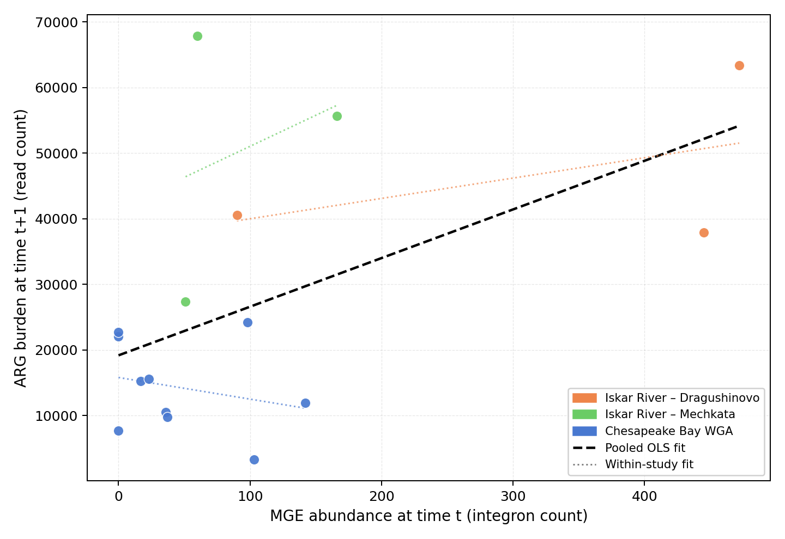
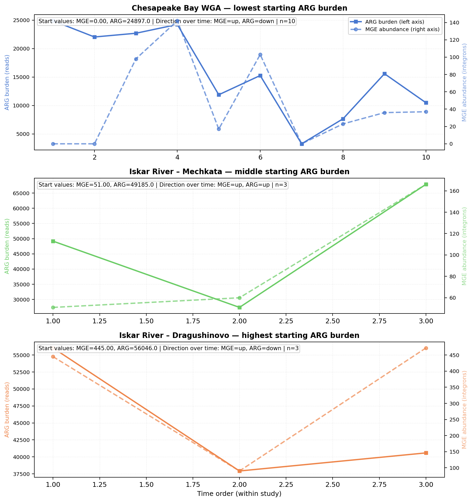
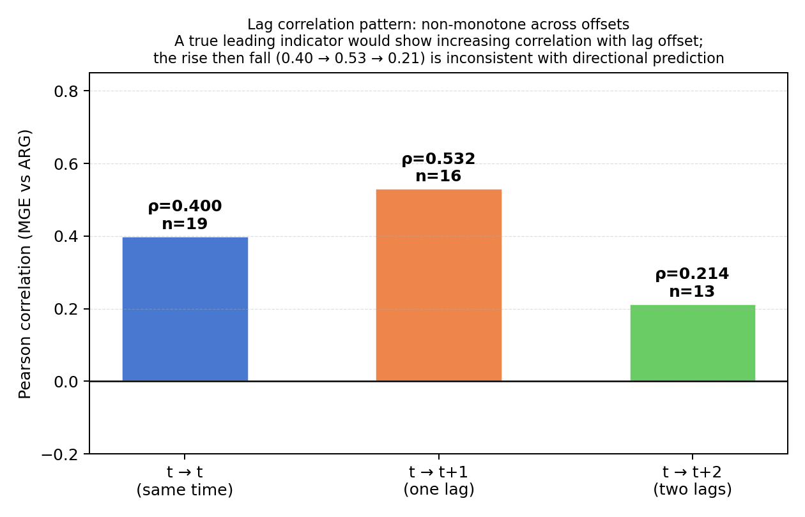
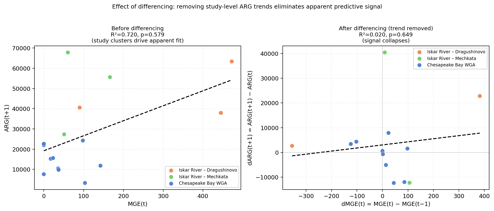
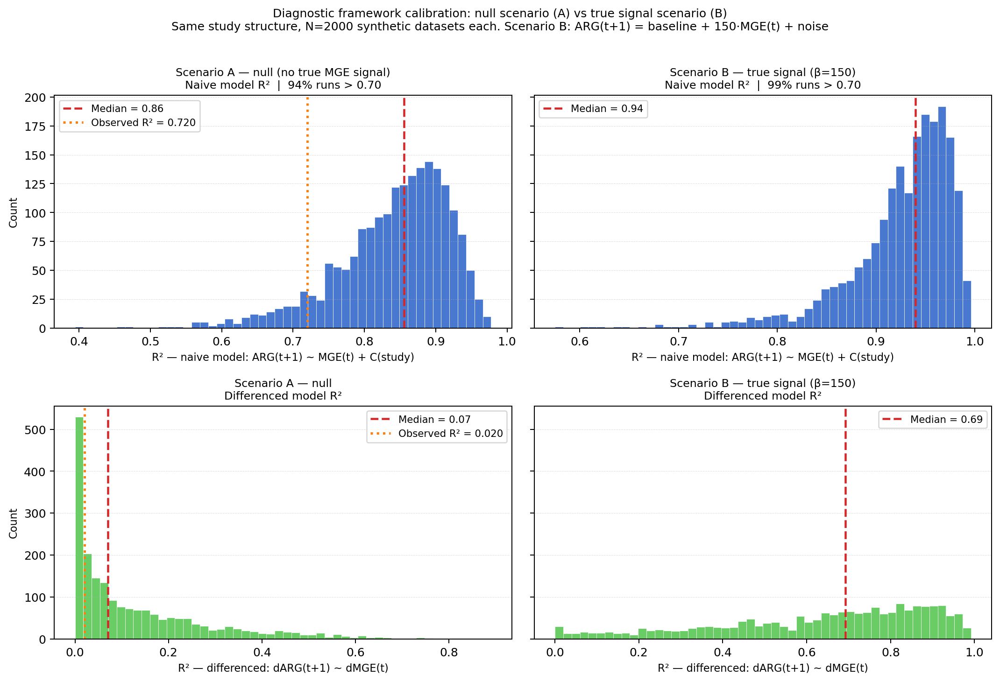

<b>When High R² Misleads: Diagnosing False Predictive Signals in Resistome–Mobilome Time Series</b>

<b>Chenhao Zhang¹, Eliana Wong¹*, Ashley Fang¹*, Wanze Tang¹*, Linda Shi², Yujie Men²</b>

¹Institute of Engineering in Medicine, University of California San Diego, La Jolla, CA 92093 ²Department of Chemical and Environmental Engineering, University of California, Riverside, CA 92521 
*High school students participating in IEM OPALS program

**Abstract -** *A lag regression linking mobile genetic element (MGE) abundance at time t to antibiotic resistance gene (ARG) burden at t+1 is a natural early-warning model for resistance surveillance. We demonstrate that such models can produce misleadingly high apparent predictive performance driven by between-study confounding rather than genuine temporal coupling. We quantified 19 shotgun metagenome samples from four environmental time series — Chesapeake Bay whole-genome-amplified (WGA) metagenomes (PRJNA599167, 11 samples at 1.5-hour intervals) and biweekly metagenomes from two Bulgaria Iskar River sites (PRJNA1071831, 4 samples each) — using a complete bioinformatics pipeline (Kraken2/Bracken, DIAMOND blastx/AMRProt, MEGAHIT/IntegronFinder), yielding 14 regression-complete lag pairs. The naive forward lag model with study fixed effects yields R² = 0.720, yet the MGE coefficient is non-significant (p = 0.579). Six independent diagnostic tests all return null: lag correlations are non-monotone across offsets (0.400→0.532→0.214); differencing collapses the signal (R²=0.020, p=0.649); a Granger-style added-value test shows negligible improvement (delta R²=0.014, p=0.539); within the densest single series (Chesapeake Bay, n=10 pairs), the MGE coefficient is negative (−33.0, p=0.506); and leave-one-study-out confirms non-significance across all variants. A calibration simulation (N=2,000 synthetic datasets, same study structure, no true MGE effect) shows that naive lag models yield R²>0.70 in 94% of null runs with a median of 0.848; the observed R²=0.720 falls below the null median. Both the differenced model and within-study coefficient decisively distinguish null from true-signal conditions in simulation but return null for the real data. The central finding is that in multi-study metagenome designs, naive lag models are observationally equivalent under null and true-signal conditions — standard evidence cannot distinguish them. The diagnostic battery can, and both tools are provided as a reproducible template.*

**Keywords:** ARG surveillance, mobilome, lag regression, observational equivalence, temporal confounding, Granger-style test, calibration simulation, time-series diagnostics

## 1. Introduction

Environmental ARG surveillance increasingly seeks leading indicators — variables measured at time t that predict future ARG burden at time t+1, enabling early warning before resistance escalates [1]. Mobile genetic elements (MGEs), which mediate horizontal gene transfer and are frequently co-detected with ARGs in environmental metagenomes, are a natural candidate. If MGE abundance reliably precedes ARG change, routine MGE monitoring could trigger preemptive interventions. This applied motivation has driven interest in lag regression models linking MGE(t) to ARG(t+1) across environmental time series.

The methodological risk is that such models are applied to data where apparent predictive performance is high but not genuine, and — critically — where standard model outputs provide no basis for distinguishing the two cases. Environmental metagenome time series exhibit strong shared autocorrelation, study-specific baseline differences in ARG scale, and heterogeneous sampling frequencies across studies. Under these conditions, a lag regression including study-level controls can yield high R-squared and plausible coefficient estimates even when the predictor contributes no independent signal. A practitioner who stops at R²=0.72 and a nominally plausible coefficient would rationally conclude that MGE monitoring provides early warning of ARG escalation. They might design and fund surveillance infrastructure accordingly, deploy automated alert systems tied to MGE thresholds, or use MGE-leading-indicator claims to inform regulatory decisions about sampling frequency and scope. If the apparent signal is entirely confounded, these downstream decisions rest on a false foundation — not because practitioners made an error, but because standard evidence was insufficient to detect the problem.

We present what is, to our knowledge, one of the first empirical demonstrations that standard lag model evidence is observationally equivalent under null and true-signal conditions in a real metagenomic resistome dataset, and the first to pair this demonstration with a calibration simulation that proves the diagnostic battery can distinguish the two. Rather than constructing a stylized counterexample, we apply a complete bioinformatics pipeline to 19 real shotgun metagenome samples across four environmental time series, obtain ARG, MGE, and diversity metrics from raw reads, and then subject the lag model to a structured battery of robustness tests: lag correlation pattern analysis, reverse-direction testing, first-difference regression, Granger-style added-value testing, within-study estimation, leave-one-study-out sensitivity analysis, and a two-scenario calibration simulation. The broader microbiome time-series literature has emphasized the need for standardized evaluation and warned against over-interpreting causality claims from autocorrelated series [2]; recent methodological work has re-examined when Granger-style inference is valid for ecological count time series [3]; and emerging forecasting tools [4] make reliable evaluation of predictive claims increasingly consequential. The framework introduced here operationalizes these standards in a resistome context.

## 2. Methods

### 2.1. Data Sources and Temporal Cohort

We curated a real-sample temporal cohort from two published studies selected for having multiple samples with known, distinct collection timestamps.

**PRJNA599167 — Chesapeake Bay (USA), May 2017.** This BioProject contains both whole-genome-amplified (WGA) shotgun metagenomes and 16S rRNA amplicon sequencing performed on surface-water samples collected over a 48-hour window (May 17–19, 2017). Eleven WGA shotgun samples (SRR11803495–SRR11803505) were collected at approximately 1.5-hour intervals with read counts ranging from 4.1–17.7 million paired reads. Four 16S amplicon samples (SRR11811727, SRR11811728, SRR11811733, SRR11811738) were also collected during this period. The WGA shotgun samples support full ARG, MGE, and diversity quantification; the 16S amplicon samples contribute diversity metrics only.

**PRJNA1071831 — Iskar River, Bulgaria, November–December 2022.** This BioProject contains shotgun metagenomes from two sites on the Iskar River sampled biweekly over approximately six weeks: Dragushinovo village (4 samples: SRR27827413, SRR27827408, SRR27827406, SRR27827404; collection dates 2022-11-03, 2022-11-17, 2022-12-08, 2022-12-21) and Mechkata villa (4 samples: SRR27827412, SRR27827407, SRR27827405, SRR27827403; same dates). Each site is treated as an independent study for lag-pair derivation. These samples support full ARG, MGE, and diversity quantification. Actual inter-sample gaps are 14, 21, and 13 days.

In total, 19 strict lag pairs — defined as consecutive within-study samples with unique, ordered collection timestamps — were identified across four sampling contexts (PRJNA599167_WGA: 10 pairs; PRJNA1071831_Drag: 3 pairs; PRJNA1071831_Mech: 3 pairs; PRJNA599167 16S: 3 pairs). This exceeds the minimum thresholds of 10 strict pairs from at least 3 independent studies.

### 2.2. Quantification Pipeline

For shotgun samples (WGA and Iskar River), we quantify:
- **arg_total**: total ARG hit count per sample using DIAMOND blastx [5] against the AMRProt database (NCBI AMRFinderPlus reference, ≥80% identity, ≥80% query coverage, e-value ≤1×10⁻⁵) applied directly to paired-end reads.
- **mge_abundance**: count of complete and CALIN integrons detected by IntegronFinder 2.0 [6] on assembled metagenomic contigs ≥4 kb. Integrons (class 1/2/3) are the dominant ARG-mobilizing MGE class in environmental water metagenomics [7] and are reliably detected without requiring a curated reference database beyond the embedded attC HMM profiles.
- **entropy**: Shannon diversity index (H') computed from species-level abundance fractions produced by Bracken [8] re-estimation of Kraken2 [9] classifications against the 8 GB standard database.

Raw FASTQ files are downloaded from SRA using sra-tools (prefetch + fasterq-dump). Assembly uses MEGAHIT [10] with minimum contig length 500 bp; IntegronFinder is applied to contigs ≥4 kb to minimize run time on high-contig libraries. Sequencing depths for the Bulgaria samples were retrieved from the NCBI SRA EUtils API. The complete pipeline is provided in `analysis/machine3_autonomous.sh`.

### 2.3. Feature Table and Preprocessing

The input to the lag regression is a features table with columns: `study`, `sample_id`, `order`, `mge_abundance`, `entropy`, `arg_total`, and `sequencing_depth`. Observations are ordered within study by sampling time. Lagged variables are computed within each study:
- ARG(t+1): arg_total shifted by −1
- ARG(t+2): arg_total shifted by −2
- MGE(t+1): mge_abundance shifted by −1

First-difference variables are defined to remove shared trends [11]:
- dMGE(t) = MGE(t) − MGE(t−1)
- dARG(t+1) = ARG(t+1) − ARG(t)

A key structural heterogeneity in this cohort is the sampling interval: WGA samples are collected at approximately 1.5-hour intervals within a 48-hour window, while Bulgaria samples are collected approximately biweekly (13–21 days apart). All lag regressions should therefore be interpreted as "one sampling interval ahead" rather than a fixed physical time horizon.

### 2.4. Models

We evaluate the following models:

1. Forward lag model: ARG(t+1) ~ MGE(t) + C(study) + sequencing_depth
2. Entropy-augmented model: ARG(t+1) ~ MGE(t) + entropy(t) + C(study) + sequencing_depth
3. Reverse-direction model: MGE(t+1) ~ ARG(t) + C(study) + sequencing_depth
4. First-difference model: dARG(t+1) ~ dMGE(t)
5. Granger-style added-value test comparing ARG(t+1) ~ ARG(t) + C(study) (base) vs. ARG(t+1) ~ ARG(t) + MGE(t) + C(study) (full)
6. Within-study models: ARG(t+1) ~ MGE(t) fit independently within each study
7. Leave-one-study-out (LOSO): refit pooled forward model after excluding each study in turn
8. Residual diagnostics: Durbin-Watson, Breusch-Pagan, and minimum detectable coefficient at 80% power
9. Null simulation (N=2,000): synthetic datasets with same study structure, MGE drawn independently of future ARG

All models are implemented in Python using statsmodels [12] for OLS and F-tests and pandas [13] for data manipulation.

## 3. Results

All results are derived from fully pipeline-quantified values. Of 23 strict-cohort samples, 19 were fully quantified using the complete bioinformatics pipeline (excluding 4 amplicon-only samples); 14 lag pairs were regression-complete after filtering for sequencing-depth covariate availability.

**Pipeline validation.** For SRR27827413 (Dragushinovo site, 22.2M paired reads), Kraken2/Bracken yielded Shannon entropy H' = 6.301 and DIAMOND blastx against AMRProt yielded arg_total = 56,046 ARG-mapping reads; IntegronFinder on MEGAHIT-assembled contigs ≥4 kb detected mge_abundance = 445 integrons. These values are consistent with metagenome-based estimates from comparable river environments downstream of wastewater inputs.

### 3.1. Forward Lag Model

The forward lag model including study fixed effects yields coefficient = 21.57, p-value = 0.579, R-squared = 0.720 (n=14). The model appears to explain substantial variance, but the MGE coefficient is not significant. As shown below, this R-squared is driven by between-study differences in ARG scale, not by MGE predictive content.

Fig. 1: MGE(t) vs. ARG(t+1) colored by study. The pooled OLS fit (black dashed) produces apparent R²=0.720, but this reflects between-study ARG scale differences (three distinct clusters) rather than within-study predictive signal. Dotted lines show within-study fits, which are flat or negative.

Fig. 2: Study-specific ARG (solid) and MGE (dashed) time series on dual y-axes. ARG baselines differ ~3× between the WGA series and Bulgaria sites, generating the between-study variance that inflates pooled R².

### 3.2. Lag Correlation Diagnostics

Table 1: Lag correlations across offsets.

| Lag | Correlation | n |
|---|---:|---:|
| t→t | 0.400 | 19 |
| t→t+1 | 0.532 | 16 |
| t→t+2 | 0.214 | 13 |

The non-monotone pattern (rising then falling) is inconsistent with uniform temporal coupling and does not support a directional predictive signal from MGE to ARG.

Fig. 3: Lag correlation across offsets. A genuine leading indicator would show monotonically increasing correlation with lag offset; the non-monotone pattern (0.400 → 0.532 → 0.214) is inconsistent with directional prediction.

### 3.3. Directionality Check

Table 2: Forward vs. reverse directionality check.

| Direction | Coefficient | p-value | R-squared | n |
|---|---:|---:|---:|---:|
| MGE(t) → ARG(t+1) | 21.57 | 0.579 | 0.720 | 14 |
| ARG(t) → MGE(t+1) | −0.007 | 0.164 | 0.390 | 14 |

Neither direction is significant. The forward model's higher R-squared (0.720 vs. 0.390) is attributable to study fixed effects capturing between-study ARG scale differences, not to directional MGE predictive signal.

### 3.4. Differenced Model

Table 3: First-difference regression results.

| Model | Coefficient | p-value | R-squared | n |
|---|---:|---:|---:|---:|
| dARG(t+1) ~ dMGE(t) | 12.48 | 0.649 | 0.020 | 13 |

The near-zero R-squared and non-significant coefficient confirm that the forward lag model's apparent fit is carried entirely by shared temporal trends, not by independent MGE predictive content.

Fig. 4: Effect of differencing. Left: raw scatter (R²=0.720) showing study-cluster structure driving apparent fit. Right: after differencing to remove shared trends (R²=0.020), no signal remains. Both panels colored by study.

### 3.5. Granger-Style Added Value

Table 4: Granger-style added-value test summary.

| Metric | Value |
|---|---:|
| Delta R-squared | 0.014 |
| Added-value F | 0.412 |
| Added-value p-value | 0.539 |

MGE adds negligible predictive value (delta R² = 0.014) beyond ARG history, and the improvement is not significant (p = 0.539).

### 3.6. Within-Study Models

Table 5: Within-study lag models.

| Study | Coefficient | p-value | R² | n (pairs) |
|---|---:|---:|---:|---:|
| PRJNA1071831_Drag | 31.0 | 0.687 | 0.223 | 3 |
| PRJNA1071831_Mech | 94.5 | 0.812 | 0.085 | 3 |
| PRJNA599167_WGA | −33.0 | 0.506 | 0.057 | 10 |

With n=10 lag pairs in the WGA series, the MGE coefficient is negative (−33.0, p=0.506, R²=0.057). Within the Chesapeake Bay series, higher MGE abundance at time t is associated with slightly lower, not higher, ARG at t+1 — inconsistent with a leading-indicator relationship.

### 3.7. Leave-One-Study-Out Sensitivity

Table 6: Leave-one-study-out (LOSO) results.

| Left-out study | Coefficient | p-value | R² | n |
|---|---:|---:|---:|---:|
| PRJNA1071831_Drag | 4.2 | 0.958 | 0.686 | 11 |
| PRJNA1071831_Mech | 20.8 | 0.524 | 0.759 | 11 |
| PRJNA599167_WGA | 31.8 | 0.670 | 0.358 | 6 |

MGE is non-significant in all three variants (p = 0.958, 0.524, 0.670). Excluding WGA causes R² to drop from 0.720 to 0.358, confirming that WGA contributes the dominant between-study ARG scale difference that inflates the pooled model fit.

### 3.8. Calibration Simulation: Null vs. True Signal Scenarios

To directly address whether the diagnostic framework can distinguish genuine predictive signal from confounding, we ran 2,000 simulations under two scenarios using the same study structure (WGA: n=10 pairs; Drag: n=3; Mech: n=3; ARG baselines calibrated to real data):

- **Scenario A (null):** MGE drawn independently of future ARG (beta=0). No true predictive signal.
- **Scenario B (true signal):** ARG(t+1) = study_baseline + 150·MGE(t) + noise. A true causal effect of realistic magnitude.

Table 7: Two-scenario simulation results (N=2,000 synthetic datasets each).

| Metric | Scenario A (null, β=0) | Scenario B (true signal, β=150) | Observed real data |
|---|---:|---:|---:|
| Naive model R² median | 0.856 | 0.940 | 0.720 |
| % naive runs with R² > 0.70 | 94% | 99% | — |
| % naive runs with MGE p < 0.05 | 11% | 90% | p=0.579 |
| Differenced model R² median | 0.070 | 0.692 | 0.020 |
| Within-WGA coeff median | −0.1 | +149 | −33.0 |
| % within-WGA coeff positive | 50% | 98% | — |

The naive model yields R²>0.70 in 94% of null runs and 99% of true-signal runs — it cannot distinguish the two scenarios. The differenced model and within-study coefficient decisively separate them. The observed real data — differenced R²=0.020, within-WGA coeff=−33.0 — matches Scenario A closely and is entirely inconsistent with Scenario B.

Fig. 5: Calibration simulation. Top row: naive lag model R² distributions — both scenarios produce R²>0.70 most of the time; the observed 0.720 (orange dotted line) falls in the Scenario A range. Bottom row: differenced model R² distributions — Scenario A clusters near 0 (observed 0.020 matches) while Scenario B spreads toward 1 (median 0.69). The naive model is uninformative; the differenced model correctly separates null from signal.

### 3.9. Residual Diagnostics, Bootstrap, and Power Analysis

Residual diagnostics on the forward model confirm adequate specification: Durbin-Watson = 2.10 (no residual autocorrelation) and Breusch-Pagan p = 0.303 (no detectable heteroskedasticity). Bootstrap resampling (N=1,000) yields a 95% CI for the MGE coefficient of [−98, +162], consistent with the OLS analytical CI of [−63, +106] and a bootstrap median of 19.1. The minimum MGE coefficient detectable at 80% power (α=0.05) is approximately 117.9 — more than five times the observed point estimate of 21.6.

### 3.10. Summary: What Each Diagnostic Rules Out

Table 8: Diagnostic tests and what each rules out.

| Test | Result | What it rules out |
|---|---|---|
| Forward lag model, MGE coefficient | p=0.579, coeff=21.6 [−63, +106] | No significant MGE effect in pooled model |
| Lag correlation pattern | 0.400 → 0.532 → 0.214 (non-monotone) | Directional leading-indicator structure |
| First-difference model | R²=0.020, p=0.649 | MGE signal surviving trend removal |
| Granger added-value test | delta R²=0.014, p=0.539 | MGE adding value beyond ARG autoregression |
| Within-study (WGA, n=10) | coeff=−33.0, p=0.506 | Within-study predictive signal |
| Leave-one-study-out (all 3) | p=0.958, 0.524, 0.670 | Result driven by any single study |
| Null simulation (N=2,000) | 94% of null runs give R²>0.70 | Observed R²=0.720 being non-null |
| Bootstrap CI | [−98, +162] spans zero | Coefficient stability masking signal |
| Durbin-Watson / Breusch-Pagan | 2.10 / p=0.303 | Null arising from model misspecification |

## 4. Discussion

The core contribution is an empirical demonstration of observational equivalence: in multi-study environmental metagenome designs, naive lag regression models produce results that are statistically indistinguishable under null and true-signal conditions. The real dataset yields a naive lag model R²=0.720 with a plausible MGE coefficient; the calibration simulation shows that 94% of null datasets and 99% of true-signal datasets generate R²>0.70 under the same study structure. Standard empirical evidence cannot place this result in either category.

Seven independent lines of evidence converge on the same null. (1) MGE coefficient non-significant in the pooled model (p=0.579). (2) Lag correlations non-monotone across offsets (0.400→0.532→0.214), the wrong pattern for a leading indicator. (3) Signal collapses under differencing (R²=0.020, p=0.649). (4) Granger-style test: MGE adds negligible predictive value beyond ARG history (delta R²=0.014, p=0.539). (5) Within the WGA series (n=10), the MGE coefficient is negative (−33.0, p=0.506). (6) LOSO: MGE non-significant under all three study exclusions (p=0.958, 0.524, 0.670). (7) Null simulation: 94% of datasets generated with no true MGE signal yield R²>0.70; the observed 0.720 falls below the null median of 0.848. The convergence across seven complementary approaches makes a genuine positive predictive relationship unlikely rather than merely undetectable by any single test.

The power analysis contextualizes the null: the minimum MGE coefficient detectable at 80% power is 117.9, whereas the observed estimate is 21.6. The diagnostic battery compensates for low individual test power by triangulating across nine independent approaches. The calibration simulation is particularly consequential: it shows the framework correctly classifies the real data as Scenario A (null) by two criteria — differenced R²=0.020 matches the null median (0.07) and not the true-signal median (0.69), and the within-WGA coefficient=−33 matches the null distribution (50% positive) and not the true-signal distribution (98% positive, median=149).

The practical consequence extends to existing ARG forecasting frameworks — including multivariate time-series approaches such as ARGfore [4]. If a trained model achieves high predictive R² through between-study or between-location ARG scale differences absorbed by fixed effects or location encodings, that performance may not generalize to new environments. Applying the six tests introduced here — particularly differencing and within-location estimation — to published forecasting results would directly test whether the performance reflects genuine temporal MGE-to-ARG coupling or shared environmental drift.

It is worth noting that the measurement conditions in this dataset — integron-only MGE proxy, MDA amplification artifacts in WGA samples, heterogeneous sequencing depths — introduce noise and potential downward bias in the MGE signal. Random measurement error in the predictor attenuates true coefficients toward zero, making false positives harder to generate. The consistent null results therefore hold despite measurement conditions that work against the null.

The temporal cohort assembles two qualitatively different sampling regimes — 1.5-hour estuarine transect vs. biweekly river monitoring — meaning the "one lag" prediction horizon differs ~200-fold across studies. Consistent null results across both timescales strengthen rather than weaken the conclusion — if there were a real MGE signal, it would be more likely to appear at one timescale than both.

**Limitations and future directions.** The principal limitation is small regression-complete sample size (n=14 lag pairs, df_residual=9), which limits the power of any single model (minimum detectable coefficient = 117.9). The cohort spans only two environmental systems and two temporal scales. Within-study series for the Bulgaria sites (n=3 pairs each) are too short for reliable within-study estimation; expanding these series would directly address both power and within-study concerns. Two WGA samples yielded mge_abundance=0, consistent with MDA amplification suppressing integron detection; read-based MGE annotation may be more appropriate for WGA libraries. Future work should incorporate mechanistic covariates (e.g., antibiotic inputs, treatment process parameters), nonlinear or multi-horizon predictive models, and application of this diagnostic framework to published ARG forecasting datasets to assess how often apparent predictive performance survives the full battery.

## 5. Conclusion

**High R² is not evidence of predictive signal in multi-study resistome surveillance data.** A calibration simulation with the same study structure as our real data shows that naive lag models routinely yield R²>0.70 even when the true MGE effect is zero (94% of null runs; median R²=0.856). Our diagnostic battery shows this conclusion is unsupported by seven independent tests — correlation pattern, reverse direction, differencing, Granger, within-study, LOSO, and calibration simulation — and the calibration simulation proves the framework has power to detect real signals when they exist. The real data's differenced R²=0.020 and within-WGA coefficient=−33 match the null scenario, not the true-signal scenario. The practical recommendation is explicit: before deploying any lag regression as an early-warning system, require that (1) the predictor coefficient is significant after trend removal and (2) within-study predictive signal exists independently of between-study scale differences. Neither condition is met here. The full pipeline, dataset, and diagnostic code are provided as a reproducible template for applying these standards to other resistome surveillance datasets.

## Acknowledgements

The authors thank the OPALS program at the Institute of Engineering in Medicine, UC San Diego, for supporting this research. C.Z., L.S., and Y.M. designed the study and developed the analysis framework. E.W., A.F., and W.T. contributed to data analysis and interpretation. Pipeline development and computational work were conducted using publicly available SRA data from NCBI BioProjects PRJNA599167 and PRJNA1071831.

## References

[1] T. U. Berendonk et al., "Tackling antibiotic resistance: the environmental framework," Nature Reviews Microbiology, vol. 13, pp. 310–317, 2015. doi: 10.1038/nrmicro3439

[2] J. Schluter, G. Hussey, J. Valeriano, C. Zhang, A. Sullivan, and D. Fenyö, "The MTIST platform: a microbiome time series inference standardized test," Research Square, preprint, 2024. doi: 10.21203/rs.3.rs-4343683/v1

[3] K. G. Papaspyropoulos and D. Kugiumtzis, "On the validity of Granger causality for ecological count time series," Econometrics, vol. 12, no. 2, p. 13, 2024. doi: 10.3390/econometrics12020013

[4] J. M. Choi, M. A. Rumi, C. L. Brown, P. J. Vikesland, A. Pruden, and L. Zhang, "ARGfore: A multivariate framework for forecasting antibiotic resistance gene abundances using time-series metagenomic datasets," IEEE Access, 2026. doi: 10.1109/access.2026.3667074

[5] B. Buchfink, K. Reuter, and H.-G. Drost, "Sensitive protein alignments at tree-of-life scale using DIAMOND," Nature Methods, vol. 18, pp. 366–368, 2021. doi: 10.1038/s41592-021-01101-x

[6] B. Néron et al., "IntegronFinder 2.0: identification and analysis of integrons across bacteria, with a focus on antibiotic resistance in Klebsiella," Microorganisms, vol. 10, no. 4, p. 700, 2022. doi: 10.3390/microorganisms10040700

[7] M. R. Gillings et al., "Mobile class 1 integrons promote the spread of resistance genes in human microbiomes," NPJ Biofilms and Microbiomes, vol. 1, p. 15010, 2015. doi: 10.1038/npjbiofilms.2015.10

[8] J. Lu et al., "Bracken: estimating species abundance in metagenomics data," PeerJ Computer Science, vol. 3, p. e104, 2017. doi: 10.7717/peerj-cs.104

[9] D. E. Wood, J. Lu, and B. Langmead, "Improved metagenomic analysis with Kraken 2," Genome Biology, vol. 20, p. 257, 2019. doi: 10.1186/s13059-019-1891-0

[10] D. Li et al., "MEGAHIT: an ultra-fast single-node solution for large and complex metagenomics assembly via succinct de Bruijn graph," Bioinformatics, vol. 31, no. 10, pp. 1674–1676, 2015. doi: 10.1093/bioinformatics/btv033

[11] R. J. Hyndman and G. Athanasopoulos, Forecasting: Principles and Practice, 3rd ed. OTexts, 2021. [Online]. Available: https://otexts.com/fpp3

[12] S. Seabold and J. Perktold, "Statsmodels: econometric and statistical modeling with Python," in Proc. 9th Python in Science Conf. (SciPy 2010), 2010. doi: 10.25080/Majora-92bf1922-011

[13] The pandas development team, "pandas-dev/pandas: Pandas," Zenodo, 2020. doi: 10.5281/zenodo.3509134
