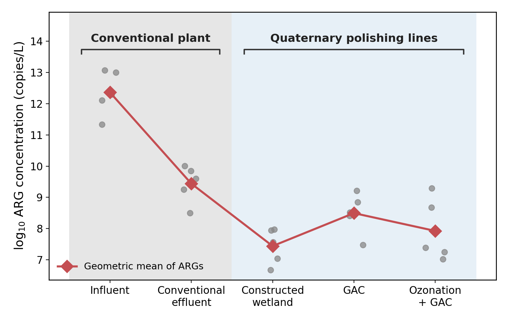
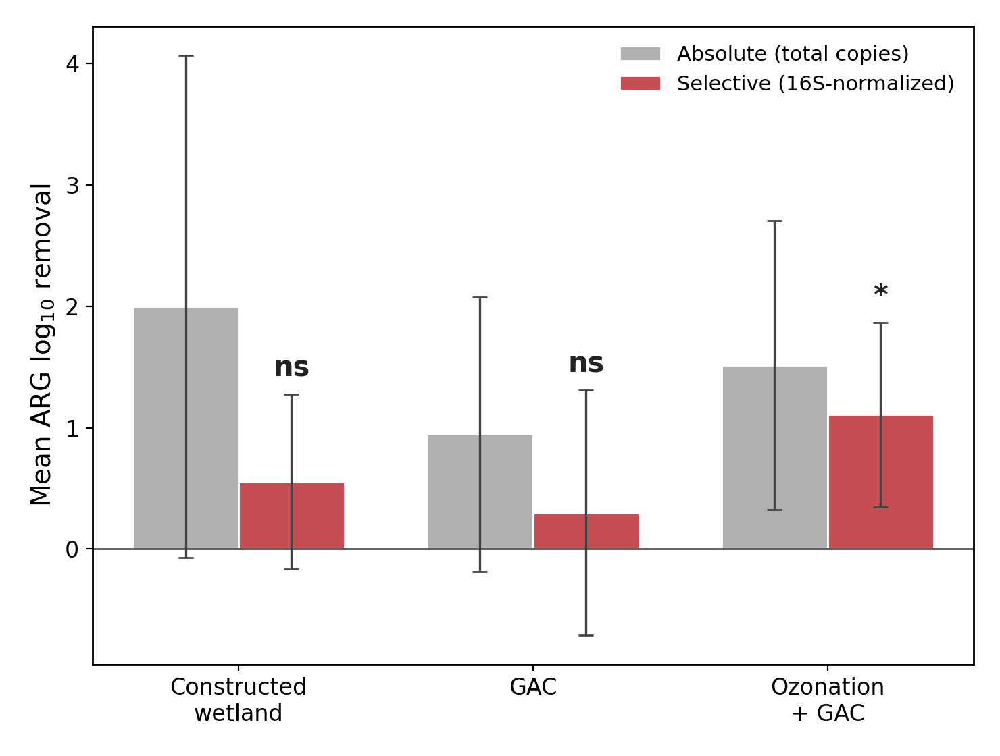
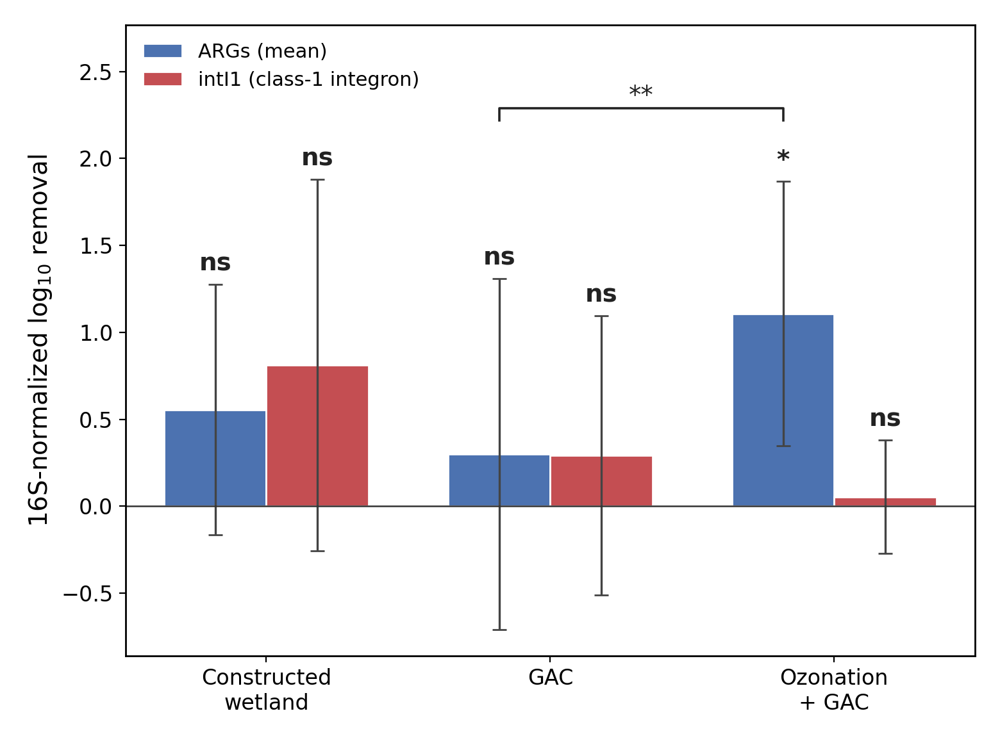
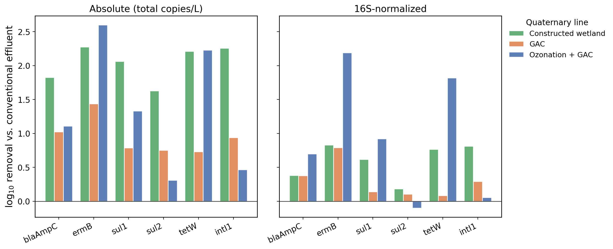
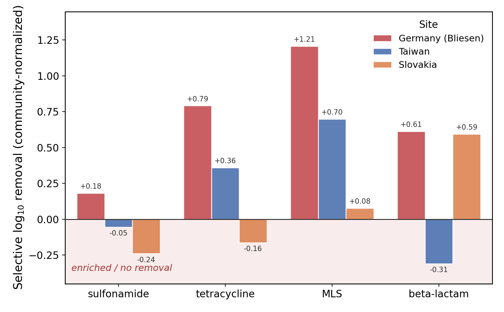

<b>Removing Antibiotic Resistance Genes Is Not the Same as Removing the Mobile Resistome: A Biomass-Normalized Analysis of Conventional and Advanced Wastewater Treatment</b>

<b>Chenhao Zhang¹, Eliana Wong¹*, Ashley Fang¹*, Wanze Tang¹*, Yujie Men², Linda Shi¹</b>

¹Institute of Engineering in Medicine, University of California San Diego, La Jolla, CA 92093 ²Department of Chemical and Environmental Engineering, University of California, Riverside, CA 92521 
*High school students participating in IEM OPALS program

**Abstract -** *Wastewater treatment plants are major conduits for the environmental dissemination of antibiotic resistance genes (ARGs), and treatment performance is usually judged by the drop in ARG abundance from influent to effluent. This endpoint can mislead in two ways. Absolute abundance (copies/L) conflates genuine resistance removal with bulk biomass removal, and total-ARG metrics do not show whether the mobile, horizontally transferable fraction is cleared. We recompute removal on a 16S rRNA-normalized basis using qPCR of six ARGs and the class-1 integron-integrase intI1 from a rural German plant whose conventional effluent is polished in parallel by a constructed wetland, granular activated carbon (GAC), and ozonation + GAC, together with conventional plants in Taiwan and Slovakia. Absolute removal ranks the constructed wetland highest, but normalization shows that this advantage is mostly biomass capture (biomass gap 1.45 log₁₀). Ozonation + GAC gives the most selective ARG removal (1.11 log₁₀, 95% CI 0.35–1.87). It reduced ARGs but did not measurably reduce intI1 (0.05 log₁₀, 95% CI −0.27–0.38). The same problem recurs in conventional treatment: across three countries, removal of the community-normalized resistome is weak and inconsistent, leaving 4 of 12 class-by-site combinations unchanged or enriched, with sulfonamide resistance poorly removed at every site. Lowering ARG counts is therefore not the same as removing resistance, least of all the mobile resistance markers associated with horizontal spread. We present a biomass-normalized, integron-aware evaluation framework, demonstrated on real datasets and provided as an open workflow, rather than a verdict on any single technology.*

**Keywords:** antibiotic resistance genes, wastewater treatment, class-1 integron, intI1, ozonation, constructed wetland, biomass normalization, mobile genetic elements

## 1. Introduction

Antibiotic resistance was associated with an estimated 1.27 million deaths in 2019 [1], and wastewater treatment plants (WWTPs) are central to how resistance moves through the environment, receiving and concentrating resistant bacteria and genes from hospitals, households, and industry [2], [3]. The revised EU Urban Wastewater Treatment Directive is pushing utilities toward advanced ("quaternary") treatment, which raises a practical question: do these stages reduce antibiotic resistance genes (ARGs)?

The answer depends on what is measured. Treatment performance is usually reported as the fall in absolute ARG abundance (copies/L) from influent to effluent. A process that only removes bacteria will lower ARG counts without reducing the resistance carried by each surviving cell. The relevant quantity is selective removal, the reduction in ARG abundance relative to total bacterial 16S rRNA, which separates resistance depletion from biomass loss. A second problem is mobility. Total-ARG abundance does not show how much resistance sits on mobile genetic elements, the fraction most associated with horizontal-transfer potential [3]. The class-1 integron-integrase gene *intI1* is a well-established screening marker for mobile, anthropogenic resistance [4], a proxy for mobility potential rather than a measurement of transfer. The sulfonamide gene *sul1* lies in the conserved 3′ region of most class-1 integrons.

We apply both ideas, biomass normalization and an explicit mobility marker, to real wastewater ARG data. The German plant treats its conventional effluent in parallel through a constructed wetland, GAC, and ozonation followed by GAC, which gives a controlled comparison of three advanced technologies measured in one framework. We place this site alongside conventional plants in Taiwan and Slovakia to test whether the patterns generalize. The standard abundance endpoint can misrank treatments, and it can hide the persistence of the mobile resistome even where ARGs are removed. The contribution is a biomass-normalized, integron-aware evaluation framework, demonstrated on real datasets, not a claim about universal treatment performance.

## 2. Methods

### 2.1 Wastewater ARG datasets

The primary dataset is qPCR quantification from a rural WWTP (~13,000 population-equivalent, Bliesen, Germany) reported by Brouwir et al. [6] (Supplementary Table S10). The plant polishes its conventional effluent in parallel through a vertical-flow constructed wetland (CW), granular activated carbon (GAC), and ozonation + GAC. qPCR quantified seven targets: 16S rRNA (the bacterial-load normalizer); the resistance genes blaAmpC, ermB, sul1, sul2, and tetW; and the class-1 integron-integrase intI1. Each target was measured at five points in the train (influent IN WWTP, conventional effluent OUT WWTP, and the CW, GAC, and ozonation + GAC effluents) over four sampling campaigns, with 13 to 16 technical replicates per target.

For cross-site context we use community-normalized influent and effluent ARG relative abundances for sulfonamide (sul1), tetracycline (tetM), macrolide/MLS (ermB), and β-lactam (blaTEM) from conventional anoxic/oxic plants in Taiwan and Slovakia, reported by Chen et al. [5] (Supplementary Table 4) and extracted programmatically.

### 2.2 Removal metrics

For each German treatment line *X*, gene *g*, and campaign, with *C* the geometric-mean concentration over replicates and *R* = *C*(g)/*C*(16S):

absolute removal = log₁₀(*C*OUT / *C*X)

selective removal = log₁₀(*R*OUT / *R*X) (16S-normalized)

Positive values denote reduction; values at or below zero denote no removal or enrichment. The biomass gap (mean absolute removal minus mean selective removal) measures how much of a line's apparent removal is only biomass loss. For each line we report the mean over four campaigns with a 95% confidence interval (Student's *t* and a campaign bootstrap). With four campaigns we report intervals rather than p-values and compare lines through paired within-campaign contrasts. For the cross-site comparison, selective removal is log10(influent_norm / effluent_norm) per site and class. All analyses and figures are scripted and openly available (see Data and code availability).

## 3. Results

The results move from the standardized German advanced-treatment comparison (Sections 3.1 and 3.2) to the cross-country conventional-treatment comparison (Section 3.3), which gives external qualitative context.

### 3.1 Absolute removal misranks the treatment lines

The conventional plant removed most of every target (2.1 to 3.5 log₁₀ from influent to effluent), and the three quaternary lines then polished the remaining effluent (Fig. 1). On an absolute basis the constructed wetland ranked highest (mean 2.0 log₁₀ across the five ARGs), ahead of ozonation + GAC (1.5) and GAC alone (0.95).

Fig. 1: ARG concentration (log₁₀ copies/L) along the German treatment train: influent, conventional effluent, then the three quaternary line effluents. Grey points are individual ARGs; the red line is their geometric mean.

This ranking is an artifact of biomass. After normalization to 16S rRNA, the constructed wetland's selective removal fell to 0.55 log₁₀ (a biomass gap of 1.45), while ozonation + GAC rose to the top at **1.11 log₁₀ (95% CI 0.35–1.87)**, removing ARGs more selectively than GAC alone (paired difference 0.81, 95% CI 0.45–1.17; Tables 1 and 2, Fig. 2). The constructed wetland's small selective effect with a large biomass gap is consistent with physical capture, and the ozonation + GAC line's small gap is consistent with chemical oxidation that degrades resistance genes directly.

Fig. 2: Absolute and 16S-normalized mean ARG removal per line. Error bars are 95% CIs over the four campaigns (exact values in Table 1). Stars over the selective (red) bars mark removal different from zero by a one-sample t-test (ns p≥0.05, * p<0.05, ** p<0.01, *** p<0.001, **** p<0.0001; n = 4 campaigns). The biomass gap (absolute minus selective removal) is 1.4, 0.6, and 0.4 log₁₀ for the constructed wetland, GAC, and ozonation + GAC: the constructed wetland's large gap is consistent with removal dominated by bacterial capture, and the ozonation + GAC line's small gap is consistent with selective ARG destruction.

### 3.2 Ozonation + GAC removes ARGs but does not measurably reduce the integron

The ozonation + GAC line removed ARGs selectively but did not measurably reduce the class-1 integron. Selective *intI1* removal was **0.05 log₁₀ (95% CI −0.27–0.38)**, which is not distinguishable from zero (Fig. 3, Table 1). The ozonation + GAC effluent can show clearly lower resistance-gene counts while keeping, per cell, the class-1 integron that captures and mobilizes those genes. The constructed wetland showed the opposite pattern: its strongest selective effect was on *intI1* (0.81 log₁₀), although with four campaigns this advantage over the other lines is not statistically resolved (Table 2). At the gene level, ozonation + GAC removed *ermB* and *tetW* strongly but removed *sul2* and *intI1* little, so the mobile and sulfonamide markers are the ones left behind (Fig. 4).

Two contrasts are statistically resolved in this dataset: ozonation + GAC's selective ARG removal exceeds zero (95% CI 0.35–1.87) and exceeds that of GAC alone (paired difference 0.81, 95% CI 0.45–1.17). The result that ozonation + GAC did not measurably reduce *intI1* is also supported, because its interval brackets zero. The stronger *intI1* depletion by the constructed wetland is suggestive only; with four campaigns the integron rankings among lines are not statistically resolved (Table 2).

Fig. 3: 16S-normalized removal of ARGs (mean) versus the class-1 integron intI1 by line. Error bars are 95% CIs over the four campaigns. Stars over each bar mark removal different from zero by a one-sample t-test, and the bracket marks the paired GAC versus ozonation + GAC contrast (ns p≥0.05, * p<0.05, ** p<0.01, *** p<0.001, **** p<0.0001; n = 4 campaigns). Ozonation + GAC reduced ARGs significantly (*) but did not measurably reduce intI1 (ns); the constructed wetland showed the largest integron depletion, but with overlapping intervals this is not statistically resolved.

Fig. 4: Per-gene log₁₀ removal by line, absolute (left) and 16S-normalized (right). Ozonation + GAC's selective removal is concentrated in ermB and tetW and is near zero for sul2 and intI1.

Table 1: Selective (16S-normalized) ARG and integron removal per line (mean over four campaigns, 95% CI).

| Line | ARG removal (95% CI) | intI1 removal (95% CI) | Biomass gap |
|---|---|---|---:|
| Constructed wetland | 0.55 (−0.17, 1.27) | 0.81 (−0.26, 1.88) | 1.45 |
| Ozonation + GAC | **1.11 (0.35, 1.87)** | **0.05 (−0.27, 0.38)** | 0.41 |
| GAC | 0.30 (−0.71, 1.31) | 0.29 (−0.51, 1.10) | 0.65 |

Table 2: Paired within-campaign line contrasts (mean difference, 95% CI).

| Contrast | ARG removal Δ (95% CI) | intI1 removal Δ (95% CI) |
|---|---|---|
| Constructed wetland − GAC | 0.26 (−1.07, 1.58) | 0.52 (−0.64, 1.67) |
| Constructed wetland − Ozonation + GAC | −0.55 (−1.70, 0.59) | 0.76 (−0.25, 1.76) |
| GAC − Ozonation + GAC | **−0.81 (−1.17, −0.45)** | 0.24 (−0.46, 0.94) |

### 3.3 Conventional treatment removes the resistome weakly across three countries

This limitation is not unique to the German site. Scored on the same community-normalized basis, conventional treatment removed the resistome weakly and inconsistently across Germany, Taiwan, and Slovakia (Fig. 5, Table 3): 4 of 12 class-by-site combinations show no reduction or outright enrichment in the effluent, and sulfonamide resistance is poorly removed at every site (−0.24 to +0.18 log₁₀). The mean selective removal across all cases is only 0.31 log₁₀, about two-fold. These are independent studies with different ARG panels and protocols, so we read the cross-site result as a consistency check on the single-site finding rather than a pooled estimate. The message is the same: conventional treatment lowers ARG counts mainly by removing biomass, not by selectively depleting resistance.

Fig. 5: Selective (community-normalized) log₁₀ removal of four ARG classes by conventional treatment in three countries. Bars in the shaded region (≤ 0) indicate ARGs unchanged or enriched in effluent.

Table 3: Selective log₁₀ removal by ARG class and site, conventional treatment (negative = enriched in effluent).

| ARG class | Germany | Taiwan | Slovakia |
|---|---:|---:|---:|
| sulfonamide | 0.18 | −0.05 | −0.24 |
| tetracycline | 0.79 | 0.36 | −0.16 |
| MLS (macrolide) | 1.21 | 0.70 | 0.08 |
| β-lactam | 0.61 | −0.31 | 0.59 |

## 4. Discussion

These results show that lowering ARG abundance is not the same as removing resistance. The metric used most often to evaluate wastewater treatment, absolute ARG copies, ranked the constructed wetland best, but normalization showed that its effect was mostly the physical capture of bacteria rather than selective depletion of resistance. Ozonation + GAC reduced resistance per unit community. The choice of metric reversed the ranking of technologies, not just the magnitudes.

Ozonation + GAC reduced ARGs but did not measurably reduce the class-1 integron, so an effluent that looks cleaner by ARG count can still carry the integron, a marker associated with horizontal-transfer potential. This pattern is consistent with ozone oxidizing accessible DNA and reducing several resistance genes while integron-bearing organisms in the surviving or regrowing post-ozonation GAC biofilm are retained. It is also consistent with the constructed wetland depleting the integron more through physical retention and competition in the wetland matrix. We did not test these mechanisms, and *intI1* is a screening marker for mobility potential, not a measurement of transfer. Several experiments could follow. One is to sequence the DNA around *intI1* before and after each line, to see which resistance genes sit on the integron. Another is to measure how much *intI1* is inside living cells versus free-floating in the water across ozonation. A third is to identify which bacteria carry the integron. A fourth is to run mating (conjugation) tests that measure how often the integron actually moves between bacteria, which would turn *intI1* from a marker into a measured transfer rate.

Wastewater ARG monitoring should change what it reports. We recommend a standard reporting package for each treatment stage:

1. absolute ARG removal (copies/L);
2. 16S-normalized (selective) ARG removal;
3. the biomass gap (the difference between 1 and 2);
4. integron removal (*intI1*), reported separately from total ARGs;
5. integron-associated *sul1*; and
6. intracellular and extracellular DNA partitioning where feasible, since advanced oxidation may act differently on each pool.

Items 1 to 3 prevent the common case in which a treatment is judged effective from falling ARG counts that mostly reflect biomass loss; items 4 and 5 show whether the mobile fraction persists.

**Limitations.** The advanced-treatment comparison comes from a single plant over four campaigns with technical replicates, so the confidence intervals are wide. Only the contrast between ozonation + GAC and GAC alone, and ozonation + GAC's own selective removal, are statistically resolved; the integron and constructed-wetland results are consistent and biologically coherent but need confirmation at more sites. The cross-country comparison uses independent studies with related but non-identical genes (tetW and tetM; blaAmpC and blaTEM), so it is qualitative. 16S normalization assumes a stable per-genome 16S copy number, and large community shifts through treatment could bias the normalized magnitudes. Because ARGs and *intI1* are normalized to the same 16S denominator within each sample, the ARG-versus-*intI1* contrast, which is the central finding, is less sensitive to this issue than comparisons of absolute normalized magnitudes across sites. Confirming and generalizing these findings will require standardized, multi-site, multi-campaign sampling of advanced-treatment trains with paired influent and effluent metagenomics and transfer assays.

## 5. Conclusion

Across conventional and advanced wastewater treatment, removing antibiotic resistance genes is not the same as removing resistance, least of all the mobile resistance markers associated with horizontal spread. Biomass normalization reversed the apparent ranking of advanced technologies and identified ozonation + GAC as the most selective ARG remover, yet ozonation + GAC did not measurably reduce the mobile class-1 integron. Conventional treatment reduced the community-normalized resistome only weakly across three countries. The contribution is a reusable, biomass-normalized and integron-aware evaluation framework, not a verdict on any one technology, and we provide it as an open workflow so that wastewater ARG surveillance can adopt these metrics. Whether advanced treatment can be engineered to remove the mobile resistome, not just the genes it carries, is the question this work raises and that standardized multi-site studies should answer.

## Data and Code Availability

All analysis code, harmonized data tables, and figure scripts are available in the project repository (`projects/paper4/` at github.com/ChenhaoZhang01/OPALS_Group19), with an archival DOI to be minted on acceptance. Primary qPCR data are from Brouwir et al. [6] (Supplementary Table S10); cross-site data from Chen et al. [5] (Supplementary Table 4). A data dictionary for all derived tables is provided in `results/DATA_PROVENANCE.md`.

## Acknowledgements

The authors thank the OPALS program at the Institute of Engineering in Medicine, UC San Diego. C.Z., L.S., and Y.M. designed the study and analysis framework; E.W., A.F., and W.T. contributed to analysis and interpretation. This work reanalyzes publicly available data from Brouwir et al. [6] and Chen et al. [5].

## References

[1] C. J. Murray, K. S. Ikuta, F. Sharara, et al., "Global burden of bacterial antimicrobial resistance in 2019: a systematic analysis," The Lancet, vol. 399, no. 10325, pp. 629–655, 2022. doi: 10.1016/S0140-6736(21)02724-0

[2] A. Pruden, R. Pei, H. Storteboom, and K. H. Carlson, "Antibiotic resistance genes as emerging contaminants: studies in northern Colorado," Environmental Science & Technology, vol. 40, no. 23, pp. 7445–7450, 2006. doi: 10.1021/es060413l

[3] T. U. Berendonk et al., "Tackling antibiotic resistance: the environmental framework," Nature Reviews Microbiology, vol. 13, no. 5, pp. 310–317, 2015. doi: 10.1038/nrmicro3439

[4] M. R. Gillings et al., "Using the class 1 integron-integrase gene as a proxy for anthropogenic pollution," The ISME Journal, vol. 9, no. 6, pp. 1269–1279, 2015. doi: 10.1038/ismej.2014.226

[5] W.-Y. Chen, C.-P. Lee, J. Pavlović, D. Pangallo, J.-H. Wu, E. Leung, et al., "Characterization of microbiome, resistome, mobilome, and virulome in anoxic and oxic wastewater treatment processes in Slovakia and Taiwan," Heliyon, vol. 10, e38723, 2024. doi: 10.1016/j.heliyon.2024.e38723

[6] L. Brouwir, H. KleinJan, C. Balent, G. Quabron, I. Salmerón, S. Venditti, F. Gritten, X. Zhao, et al., "Fate and removal of antibiotics and antibiotic resistance genes in a rural wastewater treatment plant: a microbial perspective of nature-based versus advanced technologies," Microorganisms, vol. 13, no. 12, art. 2663, 2025. doi: 10.3390/microorganisms13122663

[7] The pandas development team, "pandas-dev/pandas: Pandas," Zenodo, 2020. doi: 10.5281/zenodo.3509134
